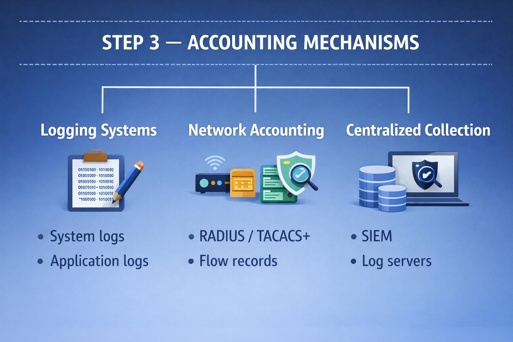

```d
Accounting
──────────────────────────────────────────────────────────────────────────────
                │
                └──▶ STEP 0 – SECURITY CONTEXT
                             │
                             ├── Definition
                             │       • Accounting is the process of
                             │         recording, tracking, and reporting
                             │         actions performed by users or systems
                             │
                             ├── Purpose
                             │       • Visibility into system usage
                             │       • Accountability for actions
                             │       • Forensic investigation and incident response
                             │       • Non-repudiation (proof of actions)
                             │       • Detecting unauthorized
                             │       • Resource usage tracking and billing
                             │
                             └── Scope
                                     • Users
                                     • Systems
                                     • Network activity
```

