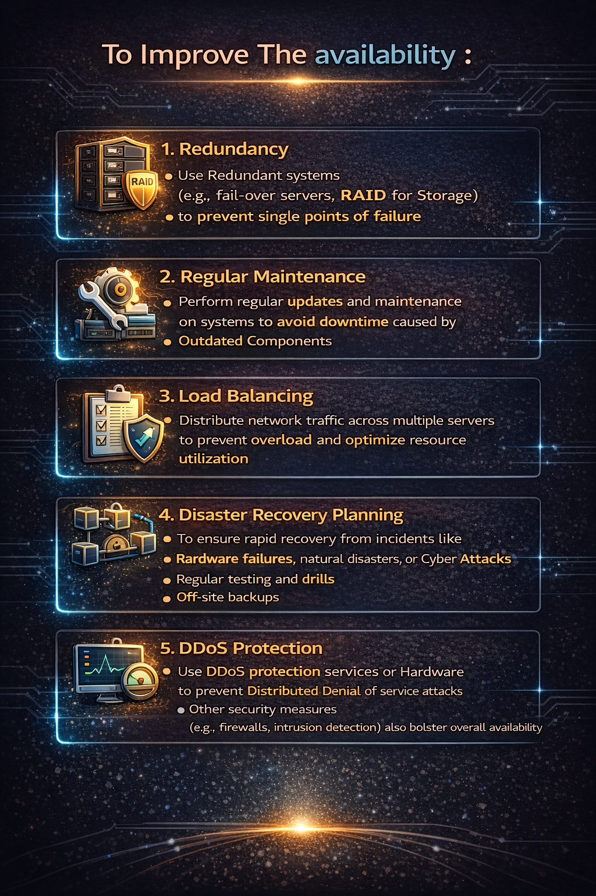

### Availability

```d
        └──▶ STEP 0 – CORE DEFINITION
                     │
                     ├── Meaning
                     │       • Availability is the principle of ensuring authorized users
                     │         can access systems, services, and data when required.
                     │
                     ├── Focus
                     │       • Prevent downtime and service disruption
                     │
                     └── Outcome
                             • Resources remain usable within acceptable time limits
                     │
        └──▶ STEP 1 – WHAT AVAILABILITY PROTECTS
                     │
                     ├── Assets
                     │       • Servers
                     │       • Applications
                     │       • Networks
                     │       • Data and backups
                     │
                     ├── Time Aspect
                     │       • Continuous access
                     │       • Scheduled access windows
                     │
                     └── Key Point
                             • Access must be reliable, not just possible
                     │
        └──▶ STEP 2 – THREATS TO AVAILABILITY
                     │
                     ├── Technical Threats
                     │       • Denial of Service attacks (DoS / DDoS)
                     │       • Hardware failures
                     │       • Resource exhaustion
                     │
                     ├── Operational Threats
                     │       • Poor capacity planning
                     │       • Misconfiguration
                     │
                     └── Logical Conclusion
                             • If users cannot access a resource, availability is broken
                     │
        └──▶ STEP 3 – AVAILABILITY CONTROLS
                     │
                     ├── Preventive Controls
                     │       • Redundancy
                     │       • Load balancing
                     │       • Capacity planning
                     │
                     ├── Recovery Controls
                     │       • Backups
                     │       • Failover mechanisms
                     │       • Disaster recovery plans
                     │
                     └── Note
                             • With redundancy and planning, it is possible to reduce downtime
                     │
        └──▶ STEP 4 – AVAILABILITY IN PRACTICE
                     │
                     ├── Example of a Redundancy Control
                     │       • If one server fails, traffic is redirected to another
                     │
                     └── Result
                             • Service continues with minimal interruption
                     │
        └──▶ FINAL STATE – AVAILABILITY MAINTAINED
                     │
                     ├── Conditions
                     │       • Redundant infrastructure
                     │       • Continuous monitoring
                     │       • Tested recovery procedures
                     │
                     └── Security Principle
                             • Availability ensures systems and data remain accessible
                               to authorized users when needed
```


