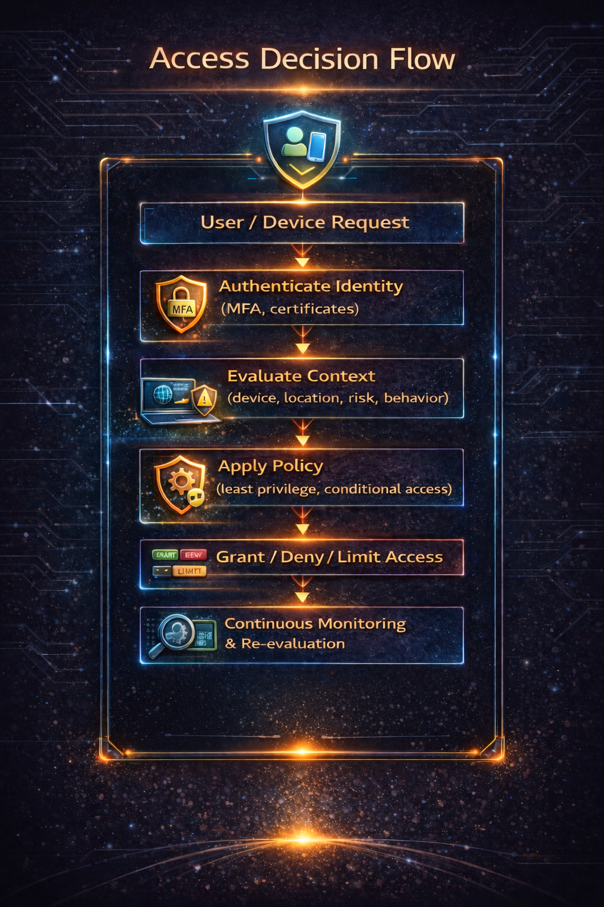
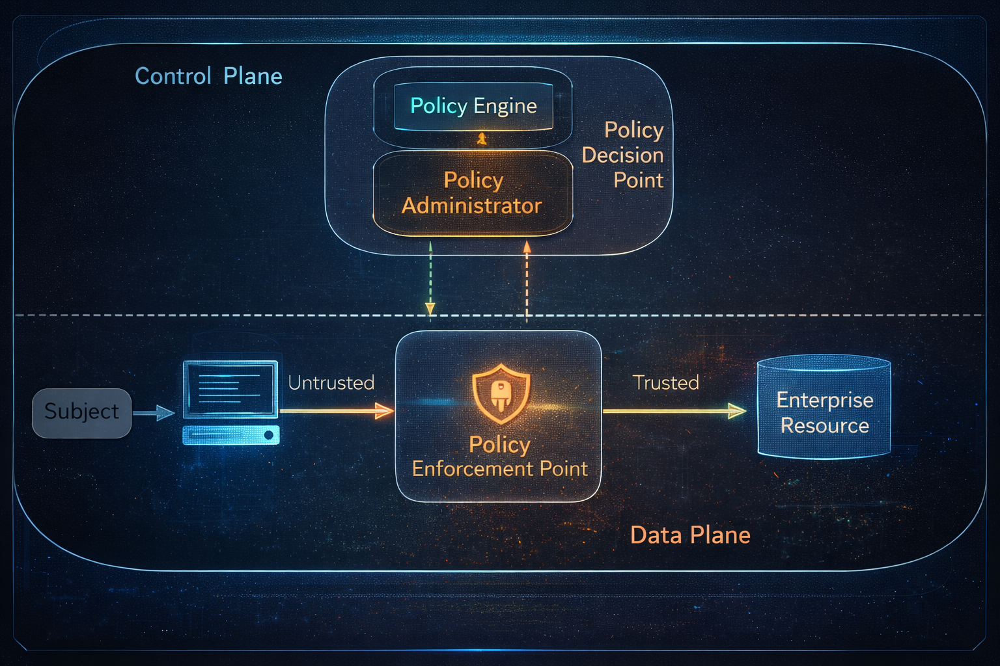
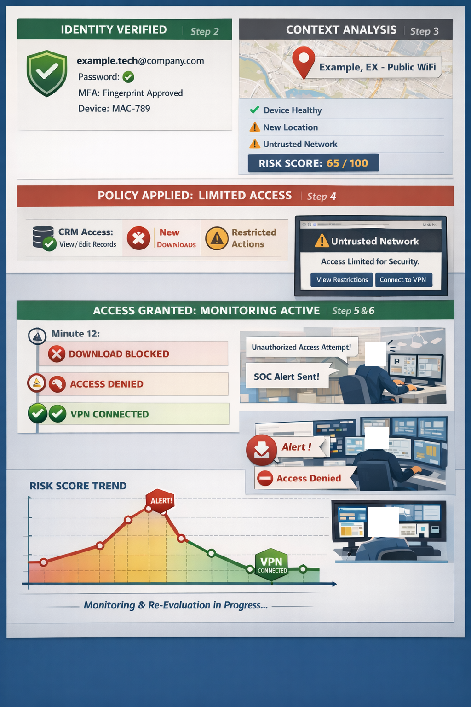

- **This image illustrates a "zero trust" security architecture, showing how access to organizational resources is controlled through policy enforcement. The primary goal is to ensure secure access through user authentication.**

